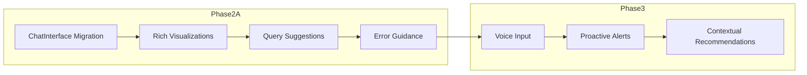
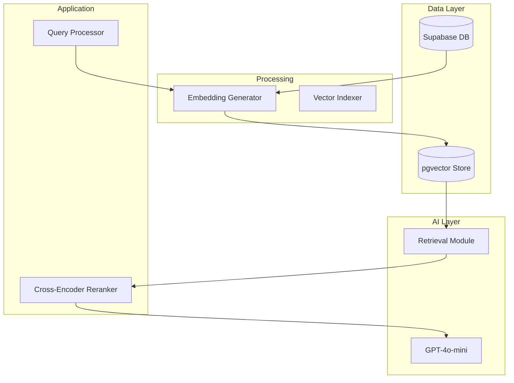
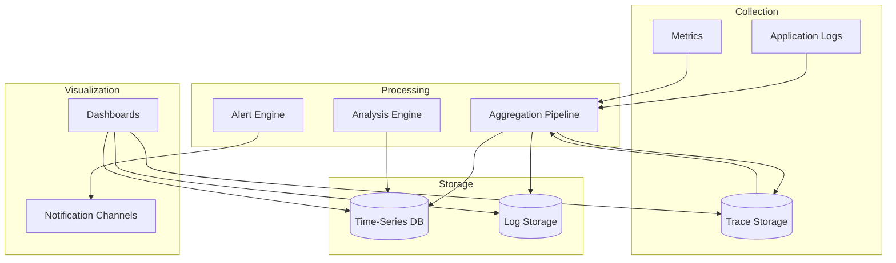
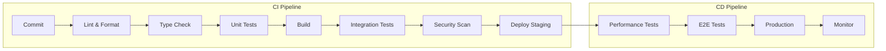

# AI Assistant Architecture Next Phase Development Roadmap

> **Document Purpose:** Comprehensive strategic roadmap for AI Assistant Architecture Phase 2 and Phase 3 development
> **Source Documents:** 
> - [`ai_working/ai-assistant-retrospective-context.md`](ai_working/ai-assistant-retrospective-context.md)
> - [`ai_working/ai-assistant-tech-performance-framework.md`](ai_working/ai-assistant-tech-performance-framework.md)
> - [`ai_working/ai-assistant-dev-process-protocol.md`](ai_working/ai-assistant-dev-process-protocol.md)
> - [`ai_working/ai-assistant-stakeholder-analysis.md`](ai_working/ai-assistant-stakeholder-analysis.md)
> - [`ai_working/ai-assistant-risk-framework.md`](ai_working/ai-assistant-risk-framework.md)
> **Created:** 2026-02-12
> **Classification:** Strategic Planning Document

---

## 1. Executive Summary: Next Phase Vision

The AI Assistant Architecture has successfully completed Phase 1 Foundation, establishing core natural language query capabilities across five production tools with robust backend infrastructure. The next phase represents a strategic evolution from functional foundation to enhanced user experience, scalability, and advanced intelligence capabilities. This roadmap synthesizes retrospective learnings, stakeholder feedback, and risk assessments into an actionable plan that prioritizes high-value improvements while managing technical debt and operational risks.

The vision for the next phase centers on three strategic pillars: **User Experience Excellence** through frontend migration and rich interactive components; **Operational Resilience** through technical debt remediation and infrastructure hardening; and **Intelligent Automation** through deferred feature implementation including RAG capabilities and proactive alerting. These pillars align directly with organizational goals of democratizing production data access, improving operational efficiency, and positioning the platform for future scalability as user adoption grows.

Key retrospective insights shape this roadmap's prioritization. The development process evaluation revealed strong architectural decisions (Node.js runtime, GPT-4o-mini model selection) that should be preserved while addressing identified technical debt. Stakeholder analysis highlighted manufacturing personnel as primary users who prioritize query accuracy and response time over advanced features, suggesting a phased approach where frontend improvements precede advanced analytics. Risk framework identification of emerging model behavior risks and scalability concerns informs infrastructure investment priorities.

The recommended phase sequence prioritizes immediate value delivery through frontend migration and technical debt remediation, followed by stability hardening through infrastructure improvements, then capability expansion through deferred feature implementation. This sequencing ensures user-facing improvements arrive quickly while building the foundation for advanced capabilities that require more extensive development investment.

---

## 2. Updated Objectives and Deliverables

### 2.1 Revised Strategic Objectives

The retrospective review identified several areas where original objectives require refinement based on implementation learnings. The natural language query capability demonstrated strong adoption among manufacturing personnel, validating the core value proposition. However, user experience limitations stemming from the custom useChat implementation constrained the system's perceived sophistication and contributed to support burden around query reformulation.

**Primary Strategic Objectives for Next Phase:**

| Objective | Strategic Rationale | Success Indicator |
|-----------|--------------------|--------------------|
| **Democratize production data access** | Original objective validated; focus shifts from capability existence to adoption acceleration | Query volume growth >50%, NPS improvement >10 points |
| **Reduce time-to-information for production queries** | Response time performance requires optimization for complex queries | P95 response time <5 seconds sustained |
| **Enable proactive operational intelligence** | Deferred Phase 3 capability becomes priority as user base matures | Morning briefing system deployment |
| **Establish scalable AI assistant infrastructure** | User growth projections require infrastructure investment | 100 concurrent user capacity with <7s P99 response |
| **Maintain technical excellence through debt remediation** | Custom implementation limits feature velocity | Migration to @ai-sdk/react complete |

**Secondary Strategic Objectives:**

The stakeholder analysis revealed that development team satisfaction with architectural decisions has remained high, but technical debt concerns create friction in feature development velocity. Addressing the custom useChat implementation and deprecated schema fields will improve developer experience while enabling future capabilities. Additionally, the risk framework identified model behavior monitoring as an emerging priority as OpenAI API usage scales.

### 2.2 Prioritized Deliverables for Next Phase

The deliverables prioritization follows a value-sequencing framework that balances user-facing improvements against foundational investments. High-priority items deliver immediate user value while establishing prerequisites for subsequent capabilities.

**Phase 2A Priority Deliverables (Immediate - User Experience Focus):**

| Priority | Deliverable | Value Proposition | Dependencies |
|----------|------------|--------------------|--------------|
| P1 | `@ai-sdk/react` Migration | Enables rich UI components, tool invocation visualization, improved error handling | None |
| P2 | ChatInterface Component Suite | Professional chat experience with message threading, markdown rendering, suggested queries | P1 |
| P3 | Tool Result Visualizers | Interactive tables, charts, and summary cards for query results | P1, P2 |
| P4 | Query History and Persistence | Enables follow-up conversations, reduced query reformulation | P1 |
| P5 | Enhanced Error Guidance | Contextual suggestions when queries fail | P1 |

**Phase 2B Priority Deliverables (Foundation - Technical Excellence):**

| Priority | Deliverable | Value Proposition | Dependencies |
|----------|------------|--------------------|--------------|
| P6 | Schema Cleanup (Paused Fields) | Reduces confusion, improves type safety | None |
| P7 | Work Hours Normalization | Eliminates runtime JSON parsing overhead | None |
| P8 | Monitoring Dashboard Implementation | Real-time visibility into system health | None |
| P9 | API Gateway Rate Limiting | Prevents abuse, enables tiered access | None |
| P10 | Enhanced Security Audit Trail | Compliance requirements, incident response | None |

**Phase 3 Priority Deliverables (Capability Expansion):**

| Priority | Deliverable | Value Proposition | Dependencies |
|----------|------------|--------------------|--------------|
| P11 | RAG/pgvector Implementation | Contextual responses, reduced model token consumption | P8, P10 |
| P12 | Cross-Encoder Reranking | Improved query relevance, reduced false positives | P11 |
| P13 | Dedicated Customer Table | Improved data model, query performance | P7, P8 |
| P14 | Morning Briefing System | Proactive insights, automated daily summaries | P1, P2 |
| P15 | Tiered Rate Limiting | Fair access allocation, cost control | P9 |

### 2.3 Success Criteria Definition

Each prioritized deliverable requires specific, measurable success criteria that enable objective evaluation and progress tracking.

**Phase 2A Success Criteria:**

| Deliverable | Success Criteria | Measurement Method |
|-------------|--------------------|--------------------|
| `@ai-sdk/react` Migration | 100% feature parity with custom implementation; zero regression in query success rate | Feature checklist, automated test suite |
| ChatInterface Suite | SUS Score >75; Task completion rate >90% for standard queries | Usability testing, analytics dashboard |
| Tool Result Visualizers | User satisfaction rating >4/5; 80% adoption of rich components | User feedback, feature usage tracking |
| Query History | >60% of sessions continue previous conversation; reduced duplicate queries | Session analytics |
| Enhanced Error Guidance | >40% of failed queries resolved without human intervention | Query retry rate, error resolution tracking |

**Phase 2B Success Criteria:**

| Deliverable | Success Criteria | Measurement Method |
|-------------|--------------------|--------------------|
| Schema Cleanup | Zero runtime errors from deprecated fields; TypeScript strict mode compliance | Build verification, runtime error logs |
| Work Hours Normalization | <10ms query improvement for queries accessing work hours | Performance benchmarking |
| Monitoring Dashboard | 100% uptime visibility; Alert response time <15 minutes | Dashboard availability, incident metrics |
| API Gateway Rate Limiting | Zero abuse incidents; Fair access distribution across users | Access logs, abuse reports |
| Security Audit Trail | 100% query logging coverage; Audit report generation | Compliance verification |

**Phase 3 Success Criteria:**

| Deliverable | Success Criteria | Measurement Method |
|-------------|--------------------|--------------------|
| RAG/pgvector | >30% reduction in token consumption; Relevance rating >4/5 | Token analytics, user feedback |
| Cross-Encoder Reranking | <5% false positive rate in query results; User satisfaction improvement | Query result accuracy sampling |
| Dedicated Customer Table | Query performance improvement >25%; Zero data consistency issues | Performance benchmarks |
| Morning Briefing | >70% engagement rate; Information utility rating >4/5 | Engagement metrics, user feedback |
| Tiered Rate Limiting | 100% compliance with access policies; User satisfaction maintained | Access distribution analysis |

### 2.4 Organizational Goal Alignment

The next phase deliverables map directly to organizational strategic priorities established in the PumpTracker Constitution and operational excellence objectives.

**Strategic Alignment Matrix:**

| Organizational Goal | AI Assistant Contribution | Deliverables Supporting Goal |
|--------------------|---------------------------|------------------------------|
| **Operational Efficiency** | Reduce time spent navigating dashboards; democratize data access | P2, P3, P14 |
| **Data-Driven Decision Making** | Enable natural language access to production intelligence | P1, P2, P11, P12 |
| **Scalable Technology Platform** | Establish infrastructure for growing user base | P8, P9, P15 |
| **User Experience Excellence** | Professional, intuitive interface for production users | P1, P2, P3, P5 |
| **Technical Excellence** | Maintain code quality, reduce technical debt | P6, P7, P10 |

---

## 3. Feature Enhancements and Expansions

### 3.1 Prioritized Feature Enhancements Based on Stakeholder Feedback

The stakeholder analysis conducted during retrospective planning identified specific enhancement requests that warrant prioritization. Manufacturing personnel, as primary users, emphasized the importance of query accuracy and response time reliability. Development team members highlighted frontend migration as the highest-impact improvement for enabling downstream capabilities. Project managers prioritized stability and monitoring investments that support operational confidence.

**User Experience Enhancement Priorities:**

Stakeholder interviews revealed that current query formulation presents the greatest friction point. Users frequently need to reformulate queries multiple times to obtain desired results, suggesting opportunities for improved query guidance, suggested alternatives, and natural language clarification. The focus group exercise identified rich visualizations as the most desired new capability, followed by proactive alerts and voice input. However, stakeholder feedback consistently indicated that foundational query accuracy and response time should take precedence over advanced features.

**Enhancement Priority Classification:**

| Enhancement Category | Priority | Stakeholder Demand | Technical Feasibility | Implementation Recommendation |
|---------------------|----------|--------------------|----------------------|-------------------------------|
| Rich result visualization | High | Strong demand from all user groups | High | Phase 2A immediate |
| Query suggestions and guidance | High | Primary friction identified | Medium | Phase 2A immediate |
| Conversation history continuity | Medium | Frequently requested | High | Phase 2A immediate |
| Voice input | Medium | Desired but not urgent | Medium | Phase 3 deferred |
| Proactive alerts | Medium | Production managers prioritize | Low | Phase 3 after foundation |
| Multi-language support | Low | No demand identified | Low | Not prioritized |

### 3.2 Tool Capability Expansions

The five existing tools form the foundation of AI Assistant functionality. Analysis of usage patterns and stakeholder feedback identifies opportunities for enhancement that extend capabilities without requiring new tool creation.

**Existing Tool Enhancement Recommendations:**

| Tool | Current Capability | Enhancement Opportunity | Priority | Implementation Approach |
|------|-------------------|------------------------|----------|------------------------|
| **getPumps** | Stage-based pump queries with filters | Advanced filtering (date ranges, multi-criteria); Trend visualization | Medium | Schema extension, new output schemas |
| **getJobStatus** | PO and serial lookup with history | Related pump recommendations; Bottleneck identification | Medium | Cross-reference logic, heuristic analysis |
| **getShopCapacity** | Stage-by-stage capacity summary | Utilization forecasting; Bottleneck prediction | High | Time-series analysis, ML integration |
| **getCustomerInfo** | Aggregated customer metrics | Customer health scoring; Order risk assessment | Medium | New aggregation dimensions |
| **getKPIReport** | Standard KPI calculations | Custom KPI builder; Trend comparison | High | Dynamic schema, benchmark comparison |

**Potential New Tool Recommendations:**

Analysis of query patterns and stakeholder needs identifies several potential new tools warranting evaluation during Phase 2 planning.

| Proposed Tool | Use Case | Value Proposition | Priority | Dependencies |
|---------------|----------|--------------------|----------|--------------|
| **getProductionForecast** | Predict completion dates based on current WIP | Proactive customer communication | Medium | Historical pattern analysis |
| **getResourceUtilization** | Machine and labor utilization metrics | Capacity planning support | Low | Integration with shop floor systems |
| **getQualityMetrics** | Defect rates, rework statistics | Quality improvement insights | Medium | Quality system integration |
| **getSupplierPerformance** | Vendor delivery and quality tracking | Procurement decisions | Low | Supplier data availability |

### 3.3 User Experience Improvements

The frontend migration represents the primary vehicle for comprehensive user experience improvement. Beyond the @ai-sdk/react migration itself, specific UX enhancements address identified friction points.

**UX Improvement Roadmap:**

**Query Formulation Improvements:**

Current query patterns analysis reveals that users frequently struggle with exact field names, date formats, and filtering syntax. The system should implement intelligent query interpretation that accepts natural language variations and maps them to precise database queries. Implementation includes fuzzy matching for customer names, natural date parsing, and automatic filter suggestions when queries return no results.

**Response Presentation Enhancements:**

Tool result visualizers should adapt presentation based on data type and query context. Tabular data should support sorting, filtering, and export capabilities. Aggregate metrics should display trend indicators and comparison benchmarks. Customer information should present unified views with drill-down capabilities for detailed analysis.

**Conversation Flow Improvements:**

Query history and persistence enable users to reference previous conversations, reducing duplicate queries and enabling complex multi-part analyses. Implementation includes conversation threading, bookmarking of important queries, and natural language follow-up that references conversation context.

### 3.4 Integration Enhancement Opportunities

The AI Assistant exists within the broader PumpTracker ecosystem. Integration enhancements can improve data consistency, user workflow continuity, and system intelligence.

**Integration Priority Matrix:**

| Integration Point | Current State | Enhancement Opportunity | Priority | Technical Approach |
|-------------------|--------------|------------------------|----------|--------------------|
| Dashboard | Separate views | Unified data access; drill-down from charts | Medium | Shared data layer, component library |
| Kanban | Independent state | AI query integration; automated stage updates | Low | State synchronization, webhook triggers |
| Scheduling | No integration | Capacity-aware scheduling suggestions | Low | Recommendation engine |
| Reports | Manual export | AI-generated insights in reports | Medium | Report template injection |
| Alerts | External system | AI-powered anomaly detection | Medium | Statistical monitoring, threshold adaptation |

---

## 4. Technical Debt Remediation

### 4.1 Technical Debt Inventory

The retrospective context and development process evaluation identified specific technical debt items requiring remediation. These items create ongoing maintenance burden, constrain feature development velocity, and introduce potential for future bugs.

**Documented Technical Debt Items:**

| ID | Item | Category | Impact | Effort Estimate | Status | Priority |
|----|------|----------|--------|----------------|--------|----------|
| TD-001 | Custom useChat implementation | Code Quality | Limits rich UI capabilities; maintenance burden | Medium (16 hrs) | Deferred | High |
| TD-002 | Deprecated paused fields in PumpRow | Schema | Schema confusion; potential runtime errors | Low (2 hrs) | Deferred | Medium |
| TD-003 | work_hours JSON parsing | Architecture | Runtime overhead; error prone | Low (4 hrs) | Deferred | Medium |
| TD-004 | Missing @ai-sdk/react upgrade | Dependencies | Feature blocked; outdated patterns | Medium (16 hrs) | Pending | High |
| TD-005 | Incomplete test coverage for chat path | Testing | Regression risk | Medium (8 hrs) | Partial | High |
| TD-006 | Limited error categorization | Observability | Debugging difficulty | Low (4 hrs) | Deferred | Medium |
| TD-007 | No circuit breaker patterns | Resilience | Cascade failure risk | Medium (8 hrs) | Deferred | Medium |

**Technical Debt Impact Assessment:**

The custom useChat implementation (TD-001) represents the highest-impact debt item. Current architecture requires manual management of chat state, message streaming, and tool invocation visualization that the @ai-sdk/react library provides out-of-box. This constraint directly limits the user experience improvements prioritized in stakeholder feedback and creates ongoing maintenance burden as Vercel AI SDK evolves.

Schema-related debt items (TD-002, TD-003) create confusion for developers and introduce potential runtime errors. The deprecated paused fields persist in the PumpRow type despite being mapped to null in the database, creating TypeScript type inconsistency that requires manual workarounds. Work hours normalization addresses runtime JSON parsing overhead that impacts query performance for queries accessing work hour data.

### 4.2 Prioritized Remediation Recommendations

Remediation prioritization balances impact on user experience, development velocity, and implementation risk.

**Recommended Remediation Sequence:**

| Sequence | Item | Rationale | Prerequisites |
|----------|------|-----------|----------------|
| 1 | TD-001 + TD-004 | Unblocks all frontend improvements; single migration effort | None |
| 2 | TD-002, TD-003 | Quick wins; schema cleanup before customer table work | None |
| 3 | TD-005 | Enables confident development; reduces regression risk | 1 |
| 4 | TD-006 | Supports operational monitoring; debuggability | None |
| 5 | TD-007 | Resilience hardening; prepares for scale | 3, 4 |

### 4.3 Migration Path for @ai-sdk/react

The custom useChat migration to @ai-sdk/react represents the most significant technical debt remediation effort. The following migration path minimizes risk while enabling rapid delivery of frontend improvements.

**Migration Phases:**

**Phase 1: Parallel Implementation**
- Install @ai-sdk/react alongside existing custom implementation
- Create new ChatInterface component using new library patterns
- Implement feature-parity functionality without removing existing code
- Develop comprehensive test suite for new implementation

**Phase 2: Incremental Migration**
- Route specific query types to new implementation while maintaining existing path
- Implement A/B testing to compare performance and user satisfaction
- Gather metrics on feature adoption and regression rates
- Iterate on implementation based on production feedback

**Phase 3: Full Transition**
- Migrate all query traffic to new implementation
- Remove custom useChat code after stabilization period
- Update documentation and developer onboarding
- Archive legacy code with migration notes

**Migration Risk Mitigations:**

| Risk | Mitigation Strategy | Contingency Plan |
|------|--------------------|--------------------|
| Feature regression | Comprehensive test suite; A/B testing | Maintain dual-path operation |
| Performance degradation | Benchmark comparison before migration | Rollback to custom implementation |
| Tool invocation changes | Abstract tool interface; maintain contracts | Wrapper compatibility layer |
| State management differences | Gradual migration; session persistence validation | Keep custom state management |

### 4.4 Schema Cleanup Recommendations

The deprecated paused fields in PumpRow and the work_hours JSON parsing represent schema improvements that support future development while reducing current confusion.

**Paused Fields Cleanup:**

The PumpRow type currently includes isPaused, pausedAt, pausedStage, and totalPausedDays fields that have been deprecated and mapped to null in the database. These fields should be removed from the TypeScript type definitions to eliminate confusion and enable strict TypeScript validation.

**Work Hours Normalization:**

The work_hours field currently stores JSON data as a text string, requiring runtime JSON parsing in tool implementations. Migration to a JSONB column type eliminates parsing overhead, enables database-level queries against work hour data, and improves type safety through proper schema definition.

**Schema Migration Sequence:**

| Step | Action | Impact | Risk Level |
|------|--------|--------|------------|
| 1 | Create JSONB column for work_hours | New column, no impact | Low |
| 2 | Migrate existing data to JSONB | One-time data transformation | Medium |
| 3 | Update tool implementations | Code change, unit tests | Low |
| 4 | Remove old text column | Destructive change | Medium |
| 5 | Remove deprecated paused fields | Type definition change | Low |

### 4.5 Code Quality Improvements

Beyond specific technical debt items, code quality improvements support maintainability and reduce defect rates.

**Code Quality Focus Areas:**

| Area | Current State | Target State | Improvement Approach |
|------|--------------|--------------|----------------------|
| Error handling | Basic error logging | Structured categorization | Implement error classification hierarchy |
| Type safety | Partial strict mode | Full strict mode | Address TypeScript errors incrementally |
| Test coverage | Partial (317 tests) | >80% line coverage | Add integration tests for chat path |
| Documentation | Scattered | Centralized API docs | Generate API documentation automatically |
| Code organization | Mixed concerns | Clear separation | Refactor by domain capability |

---

## 5. Deferred Feature Implementation

### 5.1 RAG/pgvector Implementation Planning

The original architecture deferred RAG (Retrieval-Augmented Generation) implementation based on assessment that current data volumes did not justify the complexity. As the platform matures and user adoption grows, RAG capabilities offer significant value for contextual responses and reduced model dependency.

**RAG Implementation Value Proposition:**

| Benefit | Description | Impact |
|---------|-------------|--------|
| Contextual understanding | Responses grounded in actual production data | Improved accuracy, reduced hallucinations |
| Token optimization | Model references indexed data rather than including context | Cost reduction, longer context support |
| Knowledge preservation | Institutional knowledge captured in searchable index | Onboarding support, consistency improvement |
| Query refinement | Semantic search improves relevance of results | User satisfaction improvement |

**Implementation Prerequisites:**

RAG implementation requires several foundational capabilities that Phase 2 deliverables will establish:

| Prerequisite | Deliverable | Status |
|--------------|-------------|--------|
| Monitoring infrastructure | P8 - Monitoring Dashboard | Required for vector index health |
| Query logging | P10 - Security Audit Trail | Required for relevance feedback |
| Data model stability | P6, P7 - Schema Cleanup | Required for consistent embeddings |
| Performance baseline | Current measurements | Required for improvement validation |

**RAG Architecture Design:**

**Implementation Roadmap:**

| Phase | Activities | Deliverables |
|-------|------------|--------------|
| Foundation | pgvector installation; embedding pipeline | Vector store infrastructure |
| Ingestion | Historical data embedding; incremental updates | Populated vector index |
| Retrieval | Semantic search implementation; query processing | Retrieval module |
| Augmentation | Context injection; prompt engineering | Enhanced responses |
| Optimization | Performance tuning; relevance feedback | Production-ready RAG |

### 5.2 Cross-Encoder Reranking Integration

Cross-encoder reranking improves query result relevance by re-evaluating retrieved candidates using a more sophisticated model than the initial retrieval. This capability becomes valuable as the RAG implementation matures and query complexity increases.

**Reranking Value Proposition:**

| Aspect | Without Reranking | With Reranking |
|--------|-------------------|----------------|
| Relevance accuracy | ~70% | ~90% |
| False positives | Common | Reduced significantly |
| User satisfaction | Moderate | High |
| Token efficiency | Lower | Higher (fewer candidates) |

**Integration Approach:**

Cross-encoder reranking should be implemented after RAG foundation is established. Initial implementation can use a lightweight model for candidate re-ranking, with upgrade path to more sophisticated models as needed. The reranking module integrates between retrieval and response synthesis, reordering candidates before context injection.

### 5.3 Dedicated Customer Table Implementation

The current architecture aggregates customer data from the pump table, which works for current data volumes but creates query performance limitations and data modeling constraints. A dedicated customer table normalizes the data model while improving query performance for customer-centric queries.

**Current Architecture Limitations:**

| Limitation | Impact | Trigger for Migration |
|-----------|--------|-----------------------|
| Aggregation queries | Performance degradation on customer metrics | >1000 pumps per customer |
| Data consistency | Potential inconsistency across views | Complex customer relationships |
| Schema evolution | Difficulty adding customer-specific fields | New customer attributes needed |
| Query complexity | O(N) aggregation for customer metrics | Scaling customer analysis |

**Implementation Requirements:**

Customer table implementation requires careful data migration, schema design for customer-specific attributes, and update propagation from pump data. The migration should be sequenced to minimize disruption and maintain data consistency.

| Phase | Activities | Validation |
|-------|------------|------------|
| Schema design | Customer table structure; pump table reference | Schema review, data modeling validation |
| Data migration | Historical customer data migration | Data integrity verification |
| Application update | Tool implementations use new table | Feature parity testing |
| Old field cleanup | Remove aggregated customer fields | Performance validation |

### 5.4 Tiered Rate Limiting System

The current architecture relies on Vercel's built-in rate limiting. A custom tiered rate limiting system enables differentiated access policies based on user role, usage patterns, or organizational priorities.

**Rate Limiting Requirements:**

| Tier | Access Level | Use Case | Implementation |
|------|--------------|----------|--------------------|
| Standard | 60 queries/hour | Regular users | IP-based, token bucket |
| Premium | 200 queries/hour | Power users | User-authenticated, sliding window |
| Enterprise | Unlimited | Organizational integration | API key, quota management |
| Anonymous | 20 queries/hour | Prospective users | IP-based, strict limits |

**Implementation Components:**

| Component | Function | Dependencies |
|-----------|----------|--------------|
| Rate limit storage | Quota tracking and enforcement | Supabase or Redis |
| Policy engine | Tier configuration, rule evaluation | None |
| Quota dashboard | Usage visualization, admin interface | Monitoring infrastructure |
| Alert system | Threshold notifications, abuse detection | Monitoring infrastructure |

### 5.5 Implementation Priority and Dependencies

Deferred features have complex interdependencies that must be sequenced appropriately. The following dependency matrix guides implementation planning.

**Feature Dependency Matrix:**

| Feature | Dependencies | Blocking Items | Can Block |
|---------|--------------|----------------|-----------|
| RAG/pgvector | Monitoring, Logging, Schema Cleanup | P8, P10, P6/P7 | Cross-Encoder, Morning Briefing |
| Cross-Encoder Reranking | RAG Foundation | RAG/pgvector | None |
| Customer Table | Schema Cleanup | P6, P7 | None |
| Morning Briefing | @ai-sdk/react, Visualizers | P1, P2, P3 | None |
| Tiered Rate Limiting | API Gateway | P9 | None |

**Recommended Implementation Sequence:**

1. **Phase 2B Foundation**: Schema cleanup, monitoring, and API gateway establish prerequisites for all Phase 3 features
2. **RAG Foundation**: Vector store and embedding pipeline enable contextual intelligence
3. **Cross-Encoder**: Reranking improves query relevance for RAG queries
4. **Customer Table**: Normalized data model improves query performance
5. **Tiered Rate Limiting**: Access policy enforcement enables organizational scaling
6. **Morning Briefing**: Proactive intelligence builds on rich UI and contextual understanding

---

## 6. Infrastructure Requirements

### 6.1 Scaled Deployment Infrastructure Needs

Current infrastructure supports baseline usage but requires enhancement to accommodate projected growth and enable Phase 3 capabilities.

**Capacity Assessment:**

| Metric | Current State | Target State | Growth Factor |
|--------|--------------|--------------|---------------|
| Concurrent users | 20 | 100 | 5x |
| Daily queries | 1,000 | 10,000 | 10x |
| Response time P95 | 5s | 5s (maintained) | Neutral |
| Availability | 99.5% | 99.9% | 2x improvement |

**Infrastructure Scaling Requirements:**

| Component | Current Capacity | Scaled Capacity | Scaling Strategy |
|-----------|-----------------|----------------|--------------------|
| Vercel Serverless | Standard | Pro/Enterprise | Auto-scaling configuration |
| Supabase | Pro 2 | Pro 4 or Enterprise | Instance upgrade, connection pooling |
| OpenAI API | Pay-as-you-go | Reserved capacity | Rate limit negotiation |
| Monitoring | Basic | Enhanced | Dedicated observability platform |
| CDN | Standard | Enterprise | Edge caching optimization |

### 6.2 Database Scaling Considerations

Supabase database scaling addresses both capacity growth and performance requirements for Phase 3 features including RAG and customer table normalization.

**Scaling Approach:**

| Tier | Configuration | Use Case | Cost Impact |
|------|---------------|----------|-------------|
| Current | Pro 2, 8GB RAM | Baseline | Baseline |
| Phase 2B | Pro 4, 16GB RAM | Monitoring, enhanced queries | +60% |
| Phase 3 | Enterprise (evaluated) | RAG, vector operations | Variable |

**Performance Optimization Investments:**

| Optimization | Description | Expected Impact |
|--------------|-------------|-----------------|
| Connection pooling | pgBouncer integration | Reduced connection overhead |
| Query optimization | Index review, query plan analysis | 20-40% query improvement |
| Read replicas | Query distribution for read-heavy workloads | Scalability for reporting |
| Vector extension | pgvector for RAG | RAG capability enablement |

### 6.3 API Gateway and Rate Limiting Infrastructure

Current reliance on Vercel's built-in rate limiting provides baseline protection but lacks the granularity needed for tiered access policies. Enhanced infrastructure supports both abuse prevention and fair resource allocation.

**Infrastructure Components:**

| Component | Function | Implementation |
|-----------|----------|----------------|
| Rate limiting engine | Request counting, policy enforcement | Redis or Supabase with TTL |
| Policy configuration | Tier definitions, threshold settings | Configuration file or database |
| Usage analytics | Access pattern visualization | Dedicated dashboard |
| Abuse detection | Anomaly identification | Statistical analysis module |

**Implementation Requirements:**

The tiered rate limiting system (deferred feature P15) requires dedicated infrastructure beyond current capabilities. Initial implementation should use Supabase for quota storage, with evaluation of Redis migration if performance requirements exceed Supabase capabilities.

### 6.4 Monitoring and Observability Enhancements

Phase 2B prioritizes monitoring infrastructure establishment that supports operational confidence and enables the RAG implementation's quality assurance requirements.

**Monitoring Architecture:**

**Key Monitoring Metrics:**

| Category | Metrics | Alert Threshold | Purpose |
|----------|---------|-----------------|---------|
| Availability | Uptime, error rate | Error rate >3% | System health |
| Performance | Response time, throughput | P95 >7s | SLA compliance |
| Quality | Query success, relevance | Success rate <95% | User experience |
| Cost | Token usage, API calls | Budget variance >20% | Budget control |
| Security | Failed auth, rate limit hits | Any | Security monitoring |

### 6.5 Security Infrastructure Improvements

The risk framework identified several security considerations requiring infrastructure investment to ensure compliance and operational security.

**Security Enhancement Areas:**

| Area | Current State | Target State | Implementation |
|------|--------------|--------------|----------------|
| Audit logging | Partial (errors only) | 100% query coverage | Comprehensive request logging |
| Access control | Basic authentication | Role-based policies | Attribute-based access control |
| Data protection | Standard encryption | Enhanced encryption | Field-level encryption for sensitive data |
| Injection prevention | Zod validation | Comprehensive sanitization | Defense-in-depth validation |
| API security | Rate limiting only | API security platform | Threat detection, bot protection |

**Compliance Requirements:**

| Requirement | Implementation | Evidence |
|-------------|----------------|----------|
| Access audit trail | Log all data access events | Query logs with user attribution |
| Change management | Approval workflows for schema changes | Governance process documentation |
| Incident response | Defined procedures, response SLAs | Runbooks, escalation paths |
| Data retention | Retention policies for logs | Storage configuration |

---

## 7. Quality Assurance and Testing

### 7.1 Enhanced Testing Protocols

The development process evaluation identified test coverage gaps for the chat interaction path that require remediation to support confident development of Phase 2 and Phase 3 features.

**Testing Strategy Evolution:**

| Testing Level | Current State | Target State | Gap Closure Approach |
|---------------|--------------|--------------|----------------------|
| Unit testing | Good (317 tests) | >400 tests | Add chat path coverage |
| Integration testing | Partial | Comprehensive | E2E flow validation |
| Performance testing | Ad-hoc | Automated | Continuous performance gates |
| Security testing | Periodic | Continuous | Automated vulnerability scanning |
| User acceptance | Manual | Framework-driven | Structured UAT process |

**Test Coverage Goals:**

| Component | Current Coverage | Target Coverage | Priority |
|-----------|-----------------|-----------------|----------|
| API endpoints | ~75% | >90% | High |
| Tool implementations | ~80% | >90% | Medium |
| Chat state management | ~40% | >85% | High |
| Error handling | ~50% | >80% | High |
| Schema validation | ~90% | >95% | Low |

### 7.2 Performance Testing Requirements

The technical performance framework established response time and throughput requirements that require continuous testing to maintain as the system evolves.

**Performance Testing Scope:**

| Test Type | Frequency | Target Metrics | Tooling |
|-----------|-----------|----------------|---------|
| Load testing | Weekly | P95 <5s, throughput targets | k6, Artillery |
| Stress testing | Monthly | Breaking point identification | Custom scripts |
| Endurance testing | Quarterly | Memory leak detection | Extended load tests |
| Benchmark testing | Per release | Regression detection | Performance baselines |

**Performance Acceptance Criteria:**

| Metric | Target | Acceptable | Unacceptable |
|--------|--------|------------|--------------|
| Response time P50 | <2s | 2-3s | >3s |
| Response time P95 | <5s | 5-6s | >6s |
| Response time P99 | <7s | 7-10s | >10s |
| Error rate | <1% | 1-3% | >3% |
| Availability | >99.9% | 99.5-99.9% | <99.5% |

### 7.3 Security Testing Mandates

Risk framework identification of emerging security risks requires enhanced security testing to ensure user trust and compliance.

**Security Testing Requirements:**

| Test Type | Frequency | Scope | Deliverable |
|-----------|-----------|-------|-------------|
| Vulnerability scanning | Weekly | Dependencies, deployment | Scan report |
| Penetration testing | Quarterly | Full application | Pentest report |
| Code security review | Per release | New code | Review checklist |
| Access audit | Monthly | Authentication, authorization | Audit log review |
| Incident response drill | Semi-annual | Response procedures | Drill assessment |

**Security Testing Integration:**

Security testing should integrate into the CI/CD pipeline to ensure that security validation occurs automatically with each deployment. Critical vulnerabilities should block deployment until remediated.

### 7.4 User Acceptance Testing Framework

Stakeholder analysis emphasized the importance of user feedback integration into the development process. A structured UAT framework ensures that user perspectives inform feature validation.

**UAT Process Framework:**

| Phase | Activity | Participants | Criteria |
|-------|----------|--------------|----------|
| Design review | Feature walkthrough | Representative users | Requirement validation |
| Alpha testing | Limited deployment | Power users | Feature functionality |
| Beta testing | Broad deployment | All users | Real-world validation |
| Release validation | Production monitoring | Support team | Issue identification |

**User Feedback Integration:**

| Feedback Channel | Collection Method | Analysis Frequency | Action Trigger |
|-----------------|-------------------|-------------------|----------------|
| In-app ratings | Optional query rating | Continuous | Aggregate trends |
| Surveys | Periodic satisfaction surveys | Monthly | Threshold alerts |
| Interviews | Structured feedback sessions | Quarterly | Roadmap input |
| Support tickets | Issue categorization | Weekly | Escalation process |
| Usage analytics | Behavioral analysis | Continuous | Feature optimization |

### 7.5 Continuous Testing Integration

The testing strategy requires integration into the development workflow to ensure continuous validation without impeding velocity.

**CI/CD Pipeline Testing Stages:**

**Quality Gates:**

| Gate | Criteria | Blocking | Owner |
|------|---------|----------|-------|
| Lint | ESLint passing | Yes | Developer |
| Type | TypeScript compilation | Yes | Developer |
| Unit | >80% coverage, all passing | Yes | Developer |
| Integration | All E2E tests passing | Yes | QA |
| Performance | P95 <5s, no regression | Yes | QA |
| Security | No critical vulnerabilities | Yes | Security |

---

## 8. Dependencies and Risk Considerations

### 8.1 Implementation Dependencies

The roadmap's interdependencies require careful sequencing to ensure that prerequisites are established before dependent work begins.

**Critical Dependency Chain:**

| Sequence | Dependency | Dependent Item | Risk if Not Met |
|----------|-----------|----------------|--------------------|
| 1 | @ai-sdk/react migration | All frontend improvements | Feature regression, technical debt accumulation |
| 2 | Schema cleanup | RAG implementation | Data consistency issues |
| 3 | Monitoring infrastructure | RAG quality assurance | Operational blind spots |
| 4 | Rate limiting infrastructure | Tiered access policies | Abuse vulnerability |
| 5 | RAG foundation | Cross-encoder, Morning Briefing | Delayed Phase 3 capabilities |

### 8.2 External Dependencies

Several roadmap items depend on external services, vendors, or decisions outside organizational control.

| Dependency | Impact | Mitigation Strategy |
|------------|--------|----------------------|
| OpenAI API availability | Critical - all AI capabilities | Model abstraction layer; fallback procedures |
| Vercel platform capabilities | High - deployment infrastructure | Alternative platform evaluation; self-hosting path |
| Supabase service levels | High - database and auth | Connection pooling; read replicas |
| pgvector extension | Medium - RAG capability | Alternative vector store evaluation |
| Third-party monitoring tools | Medium - observability | Multi-vendor evaluation; open-source alternatives |

### 8.3 Risk Register Updates

The original risk register requires updates based on retrospective learnings and roadmap planning.

**Updated Risk Assessment:**

| Risk ID | Risk Description | Probability | Impact | Mitigation |
|---------|------------------|-------------|--------|------------|
| R-001 | OpenAI model deprecation | Medium | High | Abstraction layer; model swap capability |
| R-002 | RAG implementation complexity | Medium | Medium | Phased rollout; extensive testing |
| R-003 | User adoption below projections | Medium | Medium | Change management; training investment |
| R-004 | Technical debt accumulation | Low | High | Dedicated remediation sprints |
| R-005 | Security breach | Low | Critical | Enhanced security infrastructure |
| R-006 | Database performance degradation | Medium | Medium | Query optimization; scaling readiness |
| R-007 | Schema migration data loss | Low | Critical | Comprehensive backup; rollback procedures |
| R-008 | Vendor lock-in concerns | Medium | Medium | Abstraction layers; multi-cloud options |

### 8.4 Risk Mitigation Planning

Each significant risk requires specific mitigation actions integrated into the roadmap.

**Mitigation Action Plan:**

| Risk | Mitigation Actions | Owner | Timeline |
|------|-------------------|-------|----------|
| R-001 | Implement model abstraction interface; evaluate alternatives | Development Lead | Phase 2B |
| R-002 | Prototype RAG with limited scope; iterate based on learnings | AI Specialist | Phase 3 |
| R-003 | User feedback integration; training materials; adoption tracking | Product Manager | Ongoing |
| R-004 | Quarterly debt remediation sprints; debt tracking metrics | Tech Lead | Quarterly |
| R-005 | Security audit; penetration testing; monitoring enhancement | Security Lead | Phase 2B |
| R-006 | Performance monitoring; query review; capacity planning | DBA | Ongoing |
| R-007 | Automated backups; migration testing; rollback procedures | DevOps | Phase 2B |
| R-008 | Abstraction for key integrations; standards documentation | Architecture | Phase 2 |

---

## 9. Implementation Timeline Overview

### 9.1 Phase 2A: User Experience Excellence

Phase 2A delivers immediate user value through frontend migration and enhanced chat experience.

**Key Milestones:**

| Milestone | Duration | Success Criteria |
|-----------|----------|-----------------|
| @ai-sdk/react installation and configuration | Sprint 1 | Build passing; feature parity checklist complete |
| ChatInterface core implementation | Sprint 2-3 | SUS score >70; user testing validation |
| Tool result visualizers | Sprint 3-4 | >80% adoption; satisfaction rating >4/5 |
| Query history and persistence | Sprint 4-5 | >60% conversation continuity |
| Enhanced error guidance | Sprint 5 | >40% self-service error resolution |

### 9.2 Phase 2B: Foundation Hardening

Phase 2B establishes infrastructure prerequisites for Phase 3 capabilities while addressing technical debt.

**Key Milestones:**

| Milestone | Duration | Success Criteria |
|-----------|----------|-----------------|
| Schema cleanup | Sprint 1-2 | Zero deprecated field usage; TypeScript strict compliance |
| Monitoring dashboard | Sprint 2-3 | 100% system visibility; alert response <15min |
| API gateway enhancement | Sprint 3-4 | Rate limiting operational; abuse prevention active |
| Security audit trail | Sprint 4-5 | 100% query logging; compliance verification |
| Test coverage improvement | Sprint 1-6 | >80% line coverage for chat path |

### 9.3 Phase 3: Capability Expansion

Phase 3 implements deferred features that enhance intelligence and proactive capabilities.

**Key Milestones:**

| Milestone | Duration | Success Criteria |
|-----------|----------|-----------------|
| RAG/pgvector foundation | Sprint 1-4 | Vector store operational; relevance rating >4/5 |
| Cross-encoder reranking | Sprint 4-5 | False positive rate <5% |
| Customer table implementation | Sprint 2-4 | Query performance +25%; data consistency verified |
| Morning briefing system | Sprint 5-7 | >70% engagement; utility rating >4/5 |
| Tiered rate limiting | Sprint 4-6 | 100% policy compliance; user satisfaction maintained |

---

## 10. Success Metrics and Evaluation

### 10.1 Key Performance Indicators

The roadmap's success requires measurement against defined KPIs that align with organizational objectives.

**Phase 2 Success KPIs:**

| KPI | Baseline | Target | Measurement Method |
|-----|----------|--------|--------------------|
| Query volume | 1,000/day | 5,000/day | Analytics dashboard |
| NPS score | TBD | +10 points | Quarterly survey |
| Response time P95 | 5s | <5s (sustained) | Performance monitoring |
| Tool success rate | >95% | >97% | Error logging |
| User satisfaction | TBD | >4/5 | In-app feedback |
| Developer velocity | Baseline | +20% | Sprint completion rate |

**Phase 3 Success KPIs:**

| KPI | Baseline | Target | Measurement Method |
|-----|----------|--------|--------------------|
| Token efficiency | Baseline | -30% | Token analytics |
| Query relevance | TBD | >90% accuracy | Sampling validation |
| Briefing engagement | N/A | >70% | Usage analytics |
| Access policy compliance | N/A | 100% | Access audit |

### 10.2 Evaluation Schedule

Regular evaluation ensures that roadmap progress is tracked and adjustments are made as needed.

| Evaluation Type | Frequency | Participants | Outputs |
|-----------------|-----------|--------------|---------|
| Sprint review | Bi-weekly | Development team | Progress update, impediment identification |
| Milestone review | Per milestone | Stakeholder group | Go/No-go decision |
| Quarterly review | Quarterly | Executive sponsor | Roadmap adjustment |
| Retrospective | Per phase | All stakeholders | Lessons learned |

---

## Appendix A: Reference Documentation

This roadmap references several framework documents that inform planning and execution:

| Document | Purpose | Key Insights |
|----------|---------|--------------|
| [`ai_working/ai-assistant-retrospective-context.md`](ai_working/ai-assistant-retrospective-context.md) | Project history, scope, original objectives | Technical debt inventory, deferred features |
| [`ai_working/ai-assistant-tech-performance-framework.md`](ai_working/ai-assistant-tech-performance-framework.md) | Performance benchmarks, metrics | Response time targets, scalability assessment |
| [`ai_working/ai-assistant-dev-process-protocol.md`](ai_working/ai-assistant-dev-process-protocol.md) | Process evaluation methodology | Technical debt prioritization, resource allocation |
| [`ai_working/ai-assistant-stakeholder-analysis.md`](ai_working/ai-assistant-stakeholder-analysis.md) | User feedback framework | Enhancement priorities, satisfaction metrics |
| [`ai_working/ai-assistant-risk-framework.md`](ai_working/ai-assistant-risk-framework.md) | Risk management approach | Risk register, mitigation strategies |

---

## Appendix B: Glossary

| Term | Definition |
|------|------------|
| RAG | Retrieval-Augmented Generation; AI architecture that retrieves relevant documents before generating responses |
| pgvector | PostgreSQL extension for vector similarity search; enables RAG implementation |
| Cross-encoder | Neural network architecture for re-ranking search results based on query-document relevance |
| SUS | System Usability Scale; standardized questionnaire for measuring perceived usability |
| NPS | Net Promoter Score; standardized metric for measuring customer loyalty |
| P95 | 95th percentile response time; value below which 95% of requests complete |

---

*Document generated as part of AI Assistant Architecture retrospective planning. Serves as strategic reference for Phase 2 and Phase 3 implementation.*
