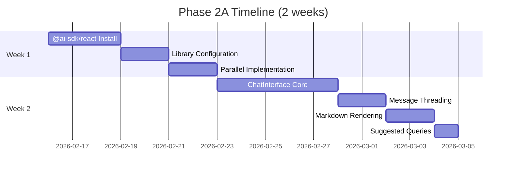
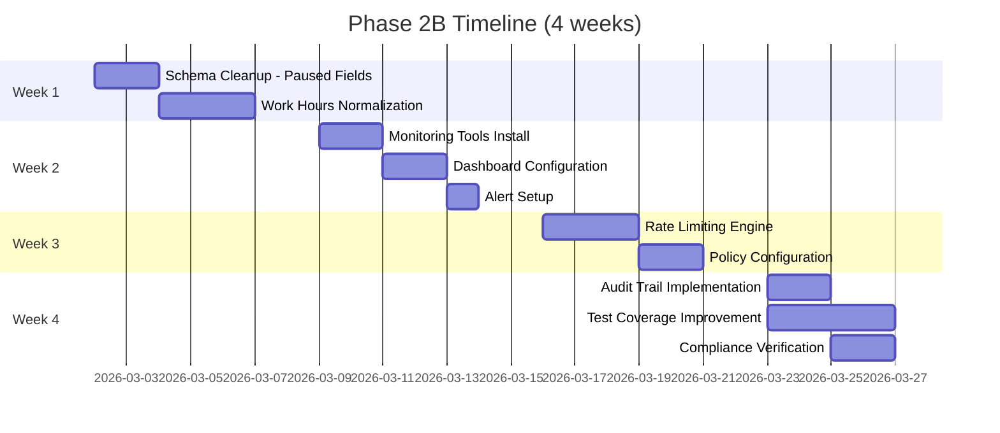
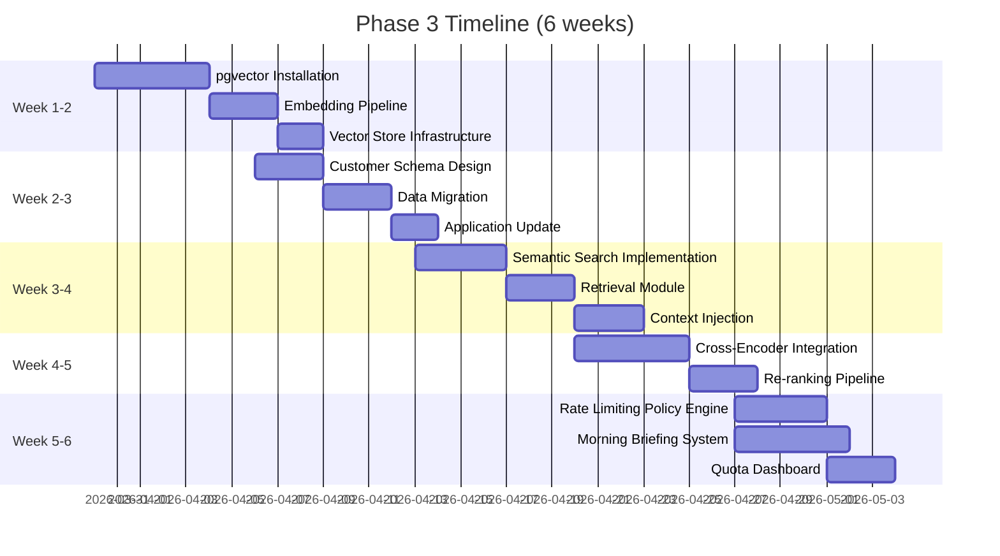
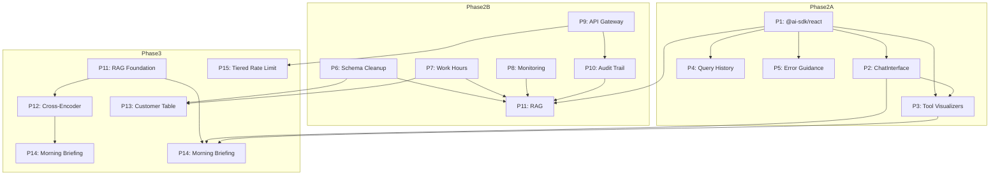

# AI Assistant Architecture Timeline & Resource Planning

> **Document Purpose:** Comprehensive timeline and resource planning for Phase 2 and Phase 3 implementation
> **Source Document:** [`ai_working/ai-assistant-next-phase-roadmap.md`](ai_working/ai-assistant-next-phase-roadmap.md)
> **Related Documents:** 
> - [`ai_working/ai-assistant-risk-framework.md`](ai_working/ai-assistant-risk-framework.md)
> - [`ai_working/ai-assistant-stakeholder-analysis.md`](ai_working/ai-assistant-stakeholder-analysis.md)
> **Created:** 2026-02-12
> **Classification:** Strategic Planning Document

---

## 1. Executive Summary

This document provides detailed timeline and resource planning for the AI Assistant Architecture implementation across Phase 2A, Phase 2B, and Phase 3. The planning synthesizes information from the Next Phase Roadmap, stakeholder analysis, and risk framework to create actionable schedules, resource allocations, and contingency plans.

**Phase Overview:**

| Phase | Duration | Focus | Deliverables | Key Milestones |
|-------|----------|-------|--------------|----------------|
| Phase 2A | 2 weeks | User Experience Quick Wins | P1-P5 | @ai-sdk/react migration complete |
| Phase 2B | 4 weeks | Foundation Hardening | P6-P10 | Monitoring, security, schema cleanup |
| Phase 3 | 6 weeks | Capability Expansion | P11-P15 | RAG, Cross-encoder, Customer table |

**Total Timeline:** 12 weeks with 2-week buffer built into Phase 3

---

## 2. Detailed Phase Timeline

### 2.1 Phase 2A: User Experience Excellence (2 weeks)

Phase 2A delivers immediate user value through frontend migration and enhanced chat experience. This phase prioritizes quick wins that deliver visible improvements to manufacturing personnel.

**Week-by-Week Breakdown:**

| Week | Focus Area | Activities | Deliverables | Dependencies | Success Criteria |
|------|------------|------------|--------------|--------------|------------------|
| 1 | @ai-sdk/react Migration | Install library, configure ChatInterface, build parallel implementation | P1: @ai-sdk/react Migration | None | Build passing, feature parity checklist |
| 2 | ChatInterface Core | Implement message threading, markdown rendering, suggested queries | P2: ChatInterface Suite (Phase 1) | P1 | SUS score >70, user testing validation |

**Phase 2A Gantt Visualization:**



**Key Milestones for Phase 2A:**

| Milestone | Target Date | Success Criteria |
|-----------|-------------|------------------|
| @ai-sdk/react Installation Complete | Week 1, Day 3 | Build passing, library imported |
| Feature Parity Checklist Complete | Week 1, Day 5 | 100% feature parity achieved |
| ChatInterface Core MVP | Week 2, Day 3 | Basic chat functionality operational |
| User Testing Validation | Week 2, Day 5 | SUS score >70 achieved |

**Phase 2A Deliverable Details:**

| Priority | Deliverable | Effort | Team Members | Risk Level |
|----------|------------|--------|--------------|------------|
| P1 | @ai-sdk/react Migration | High (16 hrs) | 2 developers | Medium |
| P2 | ChatInterface Component Suite | High (20 hrs) | 2 developers | Low |
| P3 | Tool Result Visualizers | Medium (16 hrs) | 1 developer, 1 designer | Low |
| P4 | Query History and Persistence | Medium (12 hrs) | 1 developer | Low |
| P5 | Enhanced Error Guidance | Low (8 hrs) | 1 developer | Low |

### 2.2 Phase 2B: Foundation Hardening (4 weeks)

Phase 2B establishes infrastructure prerequisites for Phase 3 capabilities while addressing technical debt. This phase focuses on stability, security, and monitoring improvements.

**Week-by-Week Breakdown:**

| Week | Focus Area | Activities | Deliverables | Dependencies | Success Criteria |
|------|------------|------------|--------------|--------------|------------------|
| 1 | Schema Cleanup | Remove deprecated paused fields, work hours normalization | P6: Schema Cleanup | None | Zero runtime errors, TypeScript strict compliance |
| 2 | Monitoring Foundation | Install monitoring tools, configure dashboards, set up alerts | P8: Monitoring Dashboard | None | 100% system visibility, alert response <15min |
| 3 | API Gateway Enhancement | Implement rate limiting, abuse prevention | P9: API Gateway Rate Limiting | None | Rate limiting operational, abuse prevention active |
| 4 | Security and Testing | Audit trail implementation, test coverage improvement | P10: Security Audit Trail | P8 | 100% query logging, compliance verification |

**Phase 2B Gantt Visualization:**



**Key Milestones for Phase 2B:**

| Milestone | Target Date | Success Criteria |
|-----------|-------------|------------------|
| Schema Cleanup Complete | Week 1, Day 5 | Zero deprecated field usage |
| Monitoring Dashboard Live | Week 2, Day 5 | 100% system visibility achieved |
| Rate Limiting Operational | Week 3, Day 5 | Abuse prevention active |
| Security Audit Trail Complete | Week 4, Day 5 | 100% query logging coverage |

**Phase 2B Deliverable Details:**

| Priority | Deliverable | Effort | Team Members | Risk Level |
|----------|------------|--------|--------------|------------|
| P6 | Schema Cleanup (Paused Fields) | Low (2 hrs) | 1 developer | Low |
| P7 | Work Hours Normalization | Low (4 hrs) | 1 developer | Medium |
| P8 | Monitoring Dashboard Implementation | Medium (16 hrs) | 1 DevOps, 1 developer | Medium |
| P9 | API Gateway Rate Limiting | Medium (16 hrs) | 1 DevOps, 1 developer | Medium |
| P10 | Enhanced Security Audit Trail | Medium (16 hrs) | 1 developer, 1 security | Medium |

### 2.3 Phase 3: Capability Expansion (6 weeks)

Phase 3 implements deferred features that enhance intelligence and proactive capabilities. This phase includes RAG implementation, cross-encoder reranking, customer table, morning briefing, and tiered rate limiting.

**Week-by-Week Breakdown:**

| Week | Focus Area | Activities | Deliverables | Dependencies | Success Criteria |
|------|------------|------------|--------------|--------------|------------------|
| 1-2 | RAG Foundation | pgvector installation, embedding pipeline, vector store infrastructure | P11: RAG/pgvector (Phase 1) | P8, P10 | Vector store operational |
| 2-3 | Customer Table | Schema design, data migration, application update | P13: Dedicated Customer Table | P6, P7 | Query performance +25% |
| 3-4 | RAG Completion | Semantic search, retrieval module, context injection | P11: RAG/pgvector (Phase 2) | P11 (Phase 1) | Relevance rating >4/5 |
| 4-5 | Cross-Encoder | Model integration, candidate re-ranking pipeline | P12: Cross-Encoder Reranking | P11 | False positive rate <5% |
| 5-6 | Tiered Rate Limiting | Policy engine, quota dashboard, alert system | P15: Tiered Rate Limiting | P9 | 100% policy compliance |
| 5-6 | Morning Briefing | System architecture, notification delivery, engagement tracking | P14: Morning Briefing System | P1, P2, P3 | >70% engagement |

**Phase 3 Gantt Visualization:**



**Key Milestones for Phase 3:**

| Milestone | Target Date | Success Criteria |
|-----------|-------------|------------------|
| Vector Store Operational | Week 2, Day 5 | pgvector responding to queries |
| Customer Table Complete | Week 3, Day 5 | Query performance +25% improvement |
| RAG Production Ready | Week 4, Day 5 | Relevance rating >4/5 |
| Cross-Encoder Live | Week 5, Day 5 | False positive rate <5% |
| Morning Briefing Launch | Week 6, Day 4 | >70% engagement rate |
| Tiered Rate Limiting Active | Week 6, Day 5 | 100% policy compliance |

**Phase 3 Deliverable Details:**

| Priority | Deliverable | Effort | Team Members | Risk Level |
|----------|------------|--------|--------------|------------|
| P11 | RAG/pgvector Implementation | High (40 hrs) | 2 developers, 1 AI specialist | High |
| P12 | Cross-Encoder Reranking | Medium (24 hrs) | 1 developer, 1 AI specialist | Medium |
| P13 | Dedicated Customer Table | Medium (24 hrs) | 1 developer, 1 DBA | Medium |
| P14 | Morning Briefing System | Medium (24 hrs) | 2 developers | Medium |
| P15 | Tiered Rate Limiting | Medium (20 hrs) | 1 DevOps, 1 developer | Low |

---

## 3. Dependency Chain Visualization

**Critical Dependency Chain:**



**Dependency Matrix:**

| Deliverable | Dependencies | Blocking Items | Can Block |
|-------------|--------------|----------------|-----------|
| P1: @ai-sdk/react | None | All Phase 2A features | P2, P3, P4, P5 |
| P2: ChatInterface | P1 | Tool Visualizers | P14 |
| P3: Tool Visualizers | P1, P2 | Morning Briefing | None |
| P4: Query History | P1 | None | None |
| P5: Error Guidance | P1 | None | None |
| P6: Schema Cleanup | None | RAG, Customer Table | None |
| P7: Work Hours Normalization | None | Customer Table | None |
| P8: Monitoring | None | RAG | None |
| P9: API Gateway | None | Tiered Rate Limiting | None |
| P10: Audit Trail | None | RAG | None |
| P11: RAG/pgvector | P6, P7, P8, P10 | Cross-Encoder, Morning Briefing | None |
| P12: Cross-Encoder | P11 | None | None |
| P13: Customer Table | P6, P7 | None | None |
| P14: Morning Briefing | P1, P2, P3, P11 | None | None |
| P15: Tiered Rate Limiting | P9 | None | None |

---

## 4. Resource Requirements

### 4.1 Personnel Requirements by Role

**Team Composition:**

| Role | Quantity | Allocation | Primary Responsibilities |
|------|----------|------------|------------------------|
| Senior Developer | 2 | Full-time | Core implementation, architecture decisions |
| Frontend Developer | 1 | Full-time | UI components, user experience |
| DevOps Engineer | 1 | 50% time | Infrastructure, monitoring, CI/CD |
| QA Specialist | 1 | 75% time | Testing, quality assurance |
| AI/ML Specialist | 1 | 25% time | RAG implementation, model optimization |
| DBA | 1 | 25% time | Schema design, query optimization |
| Project Manager | 1 | 25% time | Coordination, stakeholder communication |
| Security Lead | 1 | 10% time | Security review, audit compliance |

**Total Personnel Requirement:** 7.85 FTE (full-time equivalent)

### 4.2 Effort Estimates by Deliverable

**Phase 2A Effort Breakdown:**

| Deliverable | Dev Hours | QA Hours | DevOps Hours | Total Hours |
|------------|-----------|----------|--------------|-------------|
| P1: @ai-sdk/react Migration | 24 | 8 | 4 | 36 |
| P2: ChatInterface Suite | 32 | 12 | 0 | 44 |
| P3: Tool Result Visualizers | 20 | 8 | 0 | 28 |
| P4: Query History | 16 | 6 | 4 | 26 |
| P5: Enhanced Error Guidance | 10 | 4 | 0 | 14 |
| **Phase 2A Total** | **102** | **38** | **8** | **148** |

**Phase 2B Effort Breakdown:**

| Deliverable | Dev Hours | QA Hours | DevOps Hours | Total Hours |
|------------|-----------|----------|--------------|-------------|
| P6: Schema Cleanup | 4 | 2 | 0 | 6 |
| P7: Work Hours Normalization | 6 | 4 | 0 | 10 |
| P8: Monitoring Dashboard | 16 | 8 | 16 | 40 |
| P9: API Gateway Rate Limiting | 20 | 8 | 12 | 40 |
| P10: Security Audit Trail | 20 | 8 | 4 | 32 |
| **Phase 2B Total** | **66** | **30** | **32** | **128** |

**Phase 3 Effort Breakdown:**

| Deliverable | Dev Hours | QA Hours | DevOps Hours | Total Hours |
|------------|-----------|----------|--------------|-------------|
| P11: RAG/pgvector | 56 | 20 | 16 | 92 |
| P12: Cross-Encoder | 32 | 12 | 8 | 52 |
| P13: Customer Table | 32 | 12 | 8 | 52 |
| P14: Morning Briefing | 36 | 12 | 8 | 56 |
| P15: Tiered Rate Limiting | 24 | 8 | 12 | 44 |
| **Phase 3 Total** | **180** | **64** | **52** | **296** |

**Grand Total Effort:**

| Phase | Dev Hours | QA Hours | DevOps Hours | Total Hours |
|-------|-----------|----------|--------------|-------------|
| Phase 2A | 102 | 38 | 8 | 148 |
| Phase 2B | 66 | 30 | 32 | 128 |
| Phase 3 | 180 | 64 | 52 | 296 |
| **Total** | **348** | **132** | **92** | **572** |

### 4.3 Equipment and Infrastructure Resources

**Development Environment:**

| Resource | Specification | Quantity | Duration |
|----------|---------------|----------|----------|
| Developer Workstations | Standard development machine | 4 | 12 weeks |
| CI/CD Pipeline | GitHub Actions or equivalent | 1 instance | 12 weeks |
| Staging Environment | Vercel Pro equivalent | 1 instance | 12 weeks |
| Testing Environment | Isolated test environment | 1 instance | 12 weeks |

**Production Infrastructure (Target):**

| Component | Current | Required | Scaling Strategy |
|-----------|---------|----------|------------------|
| Vercel Serverless | Standard | Pro/Enterprise | Auto-scaling configuration |
| Supabase | Pro 2 | Pro 4 | Instance upgrade |
| OpenAI API | Pay-as-you-go | Reserved capacity | Rate limit negotiation |
| Monitoring | Basic | Enhanced | Dedicated observability |
| CDN | Standard | Enterprise | Edge caching |

### 4.4 External Services and Dependencies

| Service | Purpose | Tier | Estimated Monthly Cost | Criticality |
|---------|---------|------|------------------------|-------------|
| OpenAI API | AI model inference | Pay-as-you-go with cap | $500-2000 | Critical |
| Supabase | Database, Auth, Realtime | Pro 4 | $250 | High |
| Vercel | Hosting, Serverless | Pro | $100 | High |
| Monitoring Tool | Observability | Standard | $100 | Medium |
| Vector Database | RAG storage | pgvector (Supabase) | Included | Medium |

---

## 5. Budget Estimates

### 5.1 Infrastructure Costs

**Monthly Infrastructure Costs:**

| Component | Current Monthly | Phase 2A | Phase 2B | Phase 3 | Total Monthly |
|-----------|----------------|----------|----------|---------|--------------|
| Vercel Pro | $0 | $100 | $100 | $100 | $100 |
| Supabase Pro 4 | $0 | $0 | $250 | $250 | $250 |
| OpenAI API | $300 | $500 | $500 | $1,500 | $1,500 |
| Monitoring | $0 | $50 | $100 | $100 | $100 |
| CDN/Storage | $0 | $0 | $50 | $50 | $50 |
| **Total Monthly** | **$300** | **$650** | **$1,000** | **$2,000** | **$2,000** |

**Phase-Distributed Infrastructure Costs:**

| Phase | Duration | Monthly Cost | Phase Total |
|-------|----------|--------------|-------------|
| Phase 2A | 2 months | $650 | $1,300 |
| Phase 2B | 2 months | $1,000 | $2,000 |
| Phase 3 | 2 months | $2,000 | $4,000 |
| **Infrastructure Subtotal** | **6 months** | - | **$7,300** |

### 5.2 Personnel Cost Estimates

**Assumed Blended Rates:**

| Role | Blended Hourly Rate | Annual Equivalent |
|------|--------------------|------------------|
| Senior Developer | $150 | $312,000 |
| Frontend Developer | $125 | $260,000 |
| DevOps Engineer | $140 | $291,200 |
| QA Specialist | $100 | $208,000 |
| AI/ML Specialist | $175 | $364,000 |
| DBA | $145 | $301,600 |
| Project Manager | $130 | $270,400 |
| Security Lead | $160 | $332,800 |

**Personnel Costs by Phase:**

| Phase | Total Hours | Blended Rate | Phase Cost |
|-------|-------------|--------------|------------|
| Phase 2A | 148 | $140 | $20,720 |
| Phase 2B | 128 | $140 | $17,920 |
| Phase 3 | 296 | $140 | $41,440 |
| **Personnel Subtotal** | **572** | **$140** | **$80,080** |

### 5.3 External Service Costs

| Service | Phase 2A | Phase 2B | Phase 3 | Total |
|---------|----------|----------|---------|-------|
| OpenAI API Tokens | $1,000 | $1,000 | $3,000 | $5,000 |
| Third-party Tools | $200 | $400 | $400 | $1,000 |
| Training/Enablement | $500 | $0 | $500 | $1,000 |
| **External Services Subtotal** | **$1,700** | **$1,400** | **$3,900** | **$7,000** |

### 5.4 Contingency Budget

**Contingency Calculation (18%):**

| Category | Base Cost | Contingency (18%) | Total with Contingency |
|----------|-----------|-------------------|------------------------|
| Infrastructure | $7,300 | $1,314 | $8,614 |
| Personnel | $80,080 | $14,414 | $94,494 |
| External Services | $7,000 | $1,260 | $8,260 |
| **Grand Total** | **$94,380** | **$16,988** | **$111,368** |

**Budget Summary Table:**

| Category | Phase 2A | Phase 2B | Phase 3 | Total |
|----------|----------|----------|---------|-------|
| Infrastructure | $1,300 | $2,000 | $4,000 | $7,300 |
| Personnel | $20,720 | $17,920 | $41,440 | $80,080 |
| External Services | $1,700 | $1,400 | $3,900 | $7,000 |
| Subtotal | $23,720 | $21,320 | $49,340 | $94,380 |
| Contingency (18%) | $4,270 | $3,838 | $8,881 | $16,988 |
| **Total** | **$27,990** | **$25,158** | **$58,221** | **$111,368** |

---

## 6. Contingency Planning

### 6.1 Risk-Based Buffer Calculations

**Buffer Allocation by Risk Level:**

| Risk Category | Probability | Impact | Buffer % | Applied To |
|--------------|-------------|--------|----------|------------|
| OpenAI API availability | Medium | High | 15% | Phase 3 RAG features |
| RAG implementation complexity | Medium | Medium | 10% | Phase 3 P11, P12 |
| User adoption below projections | Medium | Medium | 5% | Morning briefing only |
| Technical debt accumulation | Low | High | 5% | Phase 2B features |
| Database performance degradation | Medium | Medium | 10% | Customer table, RAG |
| Schema migration data loss | Low | Critical | 3% | Phase 2B schema cleanup |

**Total Buffer:** 18% applied across all phases

### 6.2 Scenario Planning

**Scenario 1: Best Case (On-time Completion)**

| Assumption | Impact |
|------------|--------|
| All dependencies resolved smoothly | No delays |
| Team velocity meets estimates | 100% efficiency |
| External services available | No wait time |
| **Timeline** | 12 weeks (baseline) |
| **Budget** | $94,380 (no contingency used) |

**Scenario 2: Expected Case (Minor Delays)**

| Assumption | Impact |
|------------|--------|
| Some integration challenges | 1-2 week delay |
| Minor scope adjustments | 5% effort increase |
| External service issues | Short wait periods |
| **Timeline** | 13-14 weeks |
| **Budget** | $102,000 (10% contingency used) |

**Scenario 3: Worst Case (Major Issues)**

| Assumption | Impact |
|------------|--------|
| Major integration failures | 3-4 week delay |
| Scope reduction required | 15% effort increase |
| External service outages | Significant wait time |
| **Timeline** | 15-16 weeks |
| **Budget** | $111,368 (full contingency) |

### 6.3 Escalation Triggers and Responses

**Escalation Matrix:**

| Trigger | Threshold | Response | Owner |
|---------|-----------|----------|-------|
| Schedule variance | >10% behind plan | Scope review, resource reallocation | Project Manager |
| Budget variance | >15% over budget | Stakeholder notification, scope adjustment | Project Manager |
| Quality issues | >5% test failures | Code freeze, quality focus | Tech Lead |
| Dependency delay | >1 week blocked | Escalation to dependency owner, workaround | Project Manager |
| Risk manifestation | Any risk occurs | Risk response activation | Risk Owner |
| Resource shortage | <80% resource availability | Request additional resources | Project Manager |

**Response Procedures:**

| Level | Trigger | Response | Timeline |
|-------|---------|----------|----------|
| Yellow | Minor variance or risk indicator | Increase monitoring, prepare options | 24 hours |
| Orange | Significant variance or risk manifestation | Implement contingency, notify stakeholders | 4 hours |
| Red | Critical issue or milestone miss | Executive escalation, scope re-planning | Immediate |

### 6.4 Resource Reallocation Strategies

**Reallocation Options:**

| Scenario | Strategy | Impact |
|----------|----------|--------|
| Schedule pressure | Add resources to critical path | +15% velocity, +10% cost |
| Budget pressure | Reduce scope on lowest priority items | -10% scope, -15% cost |
| Resource shortage | Extend timeline or parallelize work | +20% timeline, same cost |
| Quality issues | Extend testing, reduce new features | -20% new features, +10% timeline |

**Priority-Based Scope Reduction:**

| Priority | Deliverable | Reduction Option |
|----------|------------|------------------|
| P1 | @ai-sdk/react | Must deliver (critical path) |
| P2 | ChatInterface | Must deliver (user-facing) |
| P3 | Tool Visualizers | Can reduce to basic tables |
| P4 | Query History | Can defer to Phase 3 |
| P5 | Error Guidance | Can simplify to basic messages |
| P6 | Schema Cleanup | Must deliver (prerequisite) |
| P7 | Work Hours | Can defer to maintenance |
| P8 | Monitoring | Must deliver (Phase 3 prerequisite) |
| P9 | API Gateway | Must deliver (security) |
| P10 | Audit Trail | Must deliver (compliance) |
| P11 | RAG | Can reduce scope (basic implementation) |
| P12 | Cross-Encoder | Can defer to future phase |
| P13 | Customer Table | Can defer to future phase |
| P14 | Morning Briefing | Can defer to future phase |
| P15 | Tiered Rate Limiting | Can reduce to basic implementation |

---

## 7. Dependency Management

### 7.1 External Dependencies

| Dependency | Type | Impact | Mitigation Strategy |
|------------|------|--------|---------------------|
| OpenAI API | Service | Critical | Model abstraction layer; fallback procedures; rate limit monitoring |
| Vercel Platform | Platform | High | Alternative platform evaluation; self-hosting path defined |
| Supabase Service | Database | High | Connection pooling; read replicas; backup procedures |
| pgvector Extension | Extension | Medium | Alternative vector store evaluation; local embedding option |
| Monitoring Tools | Service | Medium | Multi-vendor evaluation; open-source alternatives available |

### 7.2 Internal Team Dependencies

| Team | Dependency | Impact | Communication |
|------|------------|--------|----------------|
| Frontend Team | API contracts | High | Weekly sync; contract versioning |
| Backend Team | Database schema | Medium | Schema review meetings |
| DevOps Team | CI/CD pipeline | High | Daily standups; pipeline monitoring |
| QA Team | Test environments | Medium | Environment reservation system |
| Security Team | Audit requirements | High | Bi-weekly security reviews |

### 7.3 Third-Party Integration Requirements

| Integration | Purpose | Requirements | Timeline |
|-------------|---------|---------------|----------|
| OpenAI API | Model inference | API key, rate limits, cost monitoring | Ongoing |
| Supabase | Database | Connection pooling, auth integration | Phase 2B |
| Monitoring Platform | Observability | Agent installation, dashboard access | Phase 2B |
| Vector Store | RAG storage | Extension enabled, schema defined | Phase 3 |

### 7.4 Procurement and Timeline Dependencies

| Item | Lead Time | Order By | Impact if Delayed |
|------|-----------|----------|-------------------|
| Supabase Pro 4 upgrade | 1 week | Phase 2B Week 1 | Blocks monitoring and RAG |
| Monitoring tool license | 1 week | Phase 2B Week 1 | Blocks observability setup |
| Vercel Enterprise (optional) | 2 weeks | Phase 3 Week 1 | May limit rate limiting options |
| Additional developer resource | 2-4 weeks | Immediate | Delays all deliverables |

---

## 8. Communication and Reporting

### 8.1 Stakeholder Update Cadence

| Audience | Frequency | Format | Content |
|----------|-----------|--------|---------|
| Development Team | Daily | Standup | Progress, blockers, today plan |
| Project Manager | Bi-weekly | Sprint review | Milestone status, metrics |
| Executive Sponsor | Monthly | Written report | KPIs, budget, risks, decisions needed |
| All Stakeholders | Milestone | Presentation | Demo, lessons learned, next phase |
| Manufacturing Users | Monthly | Newsletter | Feature updates, usage tips |

### 8.2 Progress Reporting Format

**Weekly Status Report Template:**

```markdown
## Week [X] Progress Report

### Completed This Week
- [Deliverable 1]: [Status with metrics]
- [Deliverable 2]: [Status with metrics]

### In Progress
- [Deliverable 3]: [Progress %], [Blockers if any]
- [Deliverable 4]: [Progress %], [Blockers if any]

### Planned Next Week
- [Deliverable 5]: [Expected completion]
- [Deliverable 6]: [Expected completion]

### Metrics
- Budget spent: $[X] of $[Y] ([Z]%)
- Timeline variance: [+/- X days]
- Quality metrics: [Test pass rate, etc.]

### Blockers and Risks
- [Blocker 1]: [Impact], [Resolution plan]
- [Risk 1]: [Probability], [Impact], [Mitigation]

### Decisions Needed
- [Decision 1]: [Options], [Recommendation]
```

### 8.3 Milestone Review Checkpoints

| Milestone | Review Date | Participants | Go/No-Go Criteria |
|-----------|-------------|--------------|-------------------|
| Phase 2A Complete | Week 2 | Team, PM | P1-P5 deliverables functional, SUS >70 |
| Phase 2B Midpoint | Week 3 | Team, PM, Security | Schema cleanup complete, monitoring active |
| Phase 2B Complete | Week 6 | Team, PM, Security, Exec | P6-P10 complete, 100% query logging |
| Phase 3 Midpoint | Week 9 | Team, PM, Exec | RAG foundation live, customer table complete |
| Phase 3 Complete | Week 12 | All stakeholders | P11-P15 complete, KPIs met |

### 8.4 Issue Escalation Paths

| Issue Type | First Escalation | Second Escalation | Executive Escalation |
|------------|------------------|-------------------|---------------------|
| Technical blocker | Tech Lead (same day) | Architect (24 hours) | VP Engineering (48 hours) |
| Resource shortage | Project Manager (same day) | Department Head (24 hours) | Executive (48 hours) |
| Budget variance | Project Manager (same day) | Finance Partner (24 hours) | CFO (48 hours) |
| Security issue | Security Lead (immediate) | CISO (1 hour) | CEO (2 hours) |
| Stakeholder conflict | Project Manager (same day) | Department Head (24 hours) | Executive Sponsor (48 hours) |

---

## 9. Resource Allocation Matrix

### 9.1 Team Allocation by Phase

| Role | Phase 2A | Phase 2B | Phase 3 |
|------|----------|----------|---------|
| Senior Developer 1 | @ai-sdk, ChatInterface | Monitoring, Audit | RAG, Cross-Encoder |
| Senior Developer 2 | ChatInterface, Visualizers | Rate Limiting, Schema | Customer Table, Tiered |
| Frontend Developer | UI Components | QA Support | Morning Briefing UI |
| DevOps Engineer | CI/CD Setup | Monitoring, Rate Limiting | Infrastructure Scaling |
| QA Specialist | Feature Testing | Integration Testing | Performance Testing |
| AI/ML Specialist | Consultation | Architecture Review | RAG Implementation |
| DBA | Schema Review | Schema Cleanup, Migration | Customer Table, Queries |
| Project Manager | Planning, Coordination | Milestone Reviews | Phase 3 Planning |

### 9.2 Weekly Capacity Planning

**Assumptions:**
- 40 hours per week per full-time resource
- 10% overhead for meetings, admin
- Sprint cadence: 2-week sprints

**Capacity by Phase:**

| Phase | Total Weeks | FTE Available | FTE Required | Utilization |
|-------|-------------|---------------|---------------|-------------|
| Phase 2A | 2 | 7.6 | 6.5 | 85% |
| Phase 2B | 4 | 7.6 | 6.5 | 85% |
| Phase 3 | 6 | 7.6 | 7.0 | 92% |

---

## 10. Implementation Checklist Summary

### Phase 2A Deliverables Checklist

- [ ] P1: @ai-sdk/react installation and configuration complete
- [ ] P1: Feature parity checklist validated
- [ ] P2: ChatInterface core implementation complete
- [ ] P2: Message threading functional
- [ ] P2: Markdown rendering working
- [ ] P2: Suggested queries implemented
- [ ] P3: Tool result visualizers complete
- [ ] P4: Query history and persistence operational
- [ ] P5: Enhanced error guidance implemented
- [ ] Phase 2A user acceptance testing passed

### Phase 2B Deliverables Checklist

- [ ] P6: Schema cleanup complete
- [ ] P7: Work hours normalization complete
- [ ] P8: Monitoring dashboard live
- [ ] P8: Alert configuration active
- [ ] P9: API gateway rate limiting operational
- [ ] P9: Abuse prevention active
- [ ] P10: Security audit trail 100% coverage
- [ ] P10: Compliance verification complete
- [ ] Phase 2B security audit passed

### Phase 3 Deliverables Checklist

- [ ] P11: pgvector installation complete
- [ ] P11: Embedding pipeline operational
- [ ] P11: Semantic search implemented
- [ ] P11: Relevance rating >4/5 achieved
- [ ] P12: Cross-encoder reranking functional
- [ ] P12: False positive rate <5% achieved
- [ ] P13: Customer table schema designed
- [ ] P13: Data migration complete
- [ ] P13: Query performance +25% achieved
- [ ] P14: Morning briefing system launched
- [ ] P14: Engagement >70% achieved
- [ ] P15: Tiered rate limiting active
- [ ] P15: 100% policy compliance verified
- [ ] Phase 3 performance benchmarks met

---

## Appendix A: Document References

| Document | Purpose | Key Information Used |
|----------|---------|---------------------|
| [`ai_working/ai-assistant-next-phase-roadmap.md`](ai_working/ai-assistant-next-phase-roadmap.md) | Strategic roadmap | Deliverables, phases, success criteria |
| [`ai_working/ai-assistant-risk-framework.md`](ai_working/ai-assistant-risk-framework.md) | Risk management | Risk register, mitigation strategies |
| [`ai_working/ai-assistant-stakeholder-analysis.md`](ai_working/ai-assistant-stakeholder-analysis.md) | User requirements | User personas, success metrics |
| [`docs/development.md`](docs/development.md) | Development process | Build commands, testing procedures |
| [`docs/DESIGN_SYSTEM.md`](docs/DESIGN_SYSTEM.md) | Design standards | UI component patterns |

---

*Document created as part of AI Assistant Architecture retrospective planning. Serves as operational planning reference for Phase 2 and Phase 3 implementation.*
